# Innovation and Growth

The project provides an example projecton innovation and growth

Confidential information is not displayed.

Please download the executable in https://github.com/alpaddesai/InnovationandGrowth/releases

Images are custom.

## Project Innovation on Growth
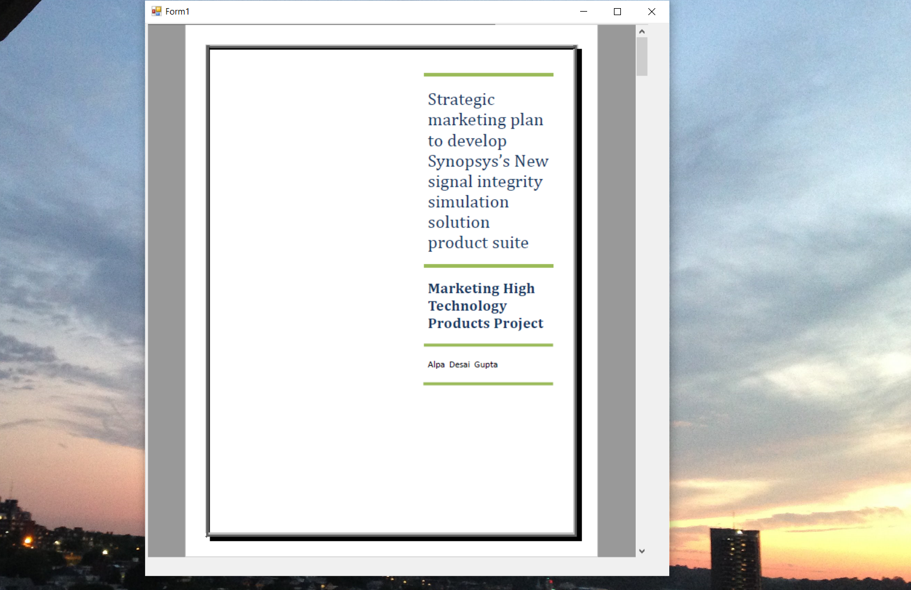

## Mkt High Products Index
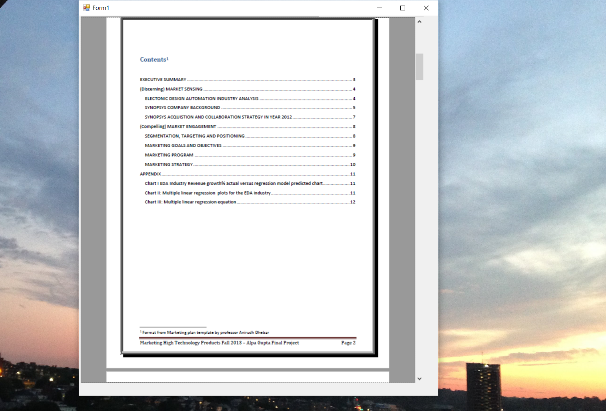

## Executive Summary
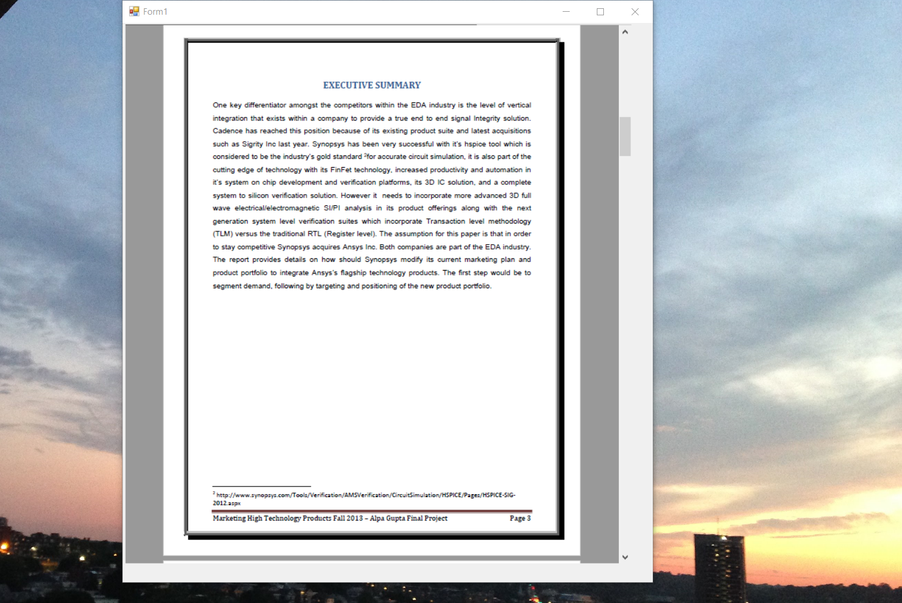

## Marketing Sensing
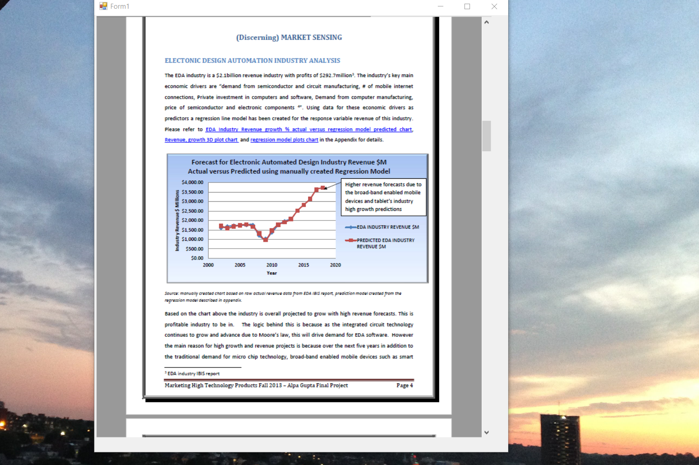

## EDA Revenue
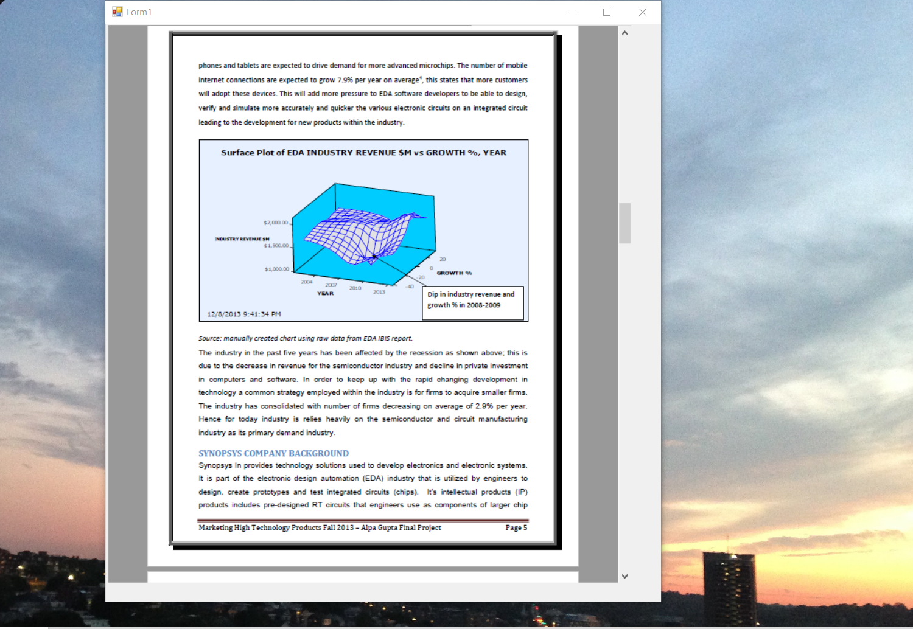

## Competitive Landscape
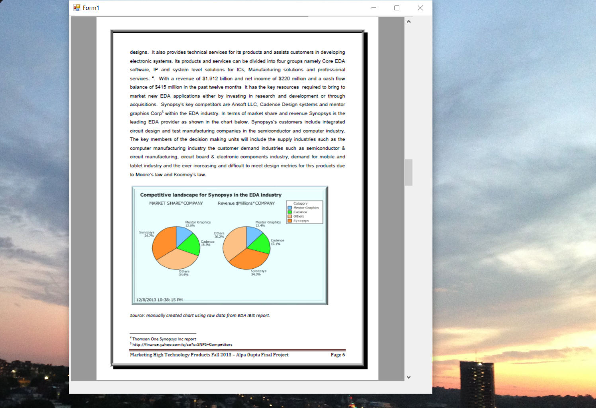

## SWOT Analysis

## Marketing Engagement
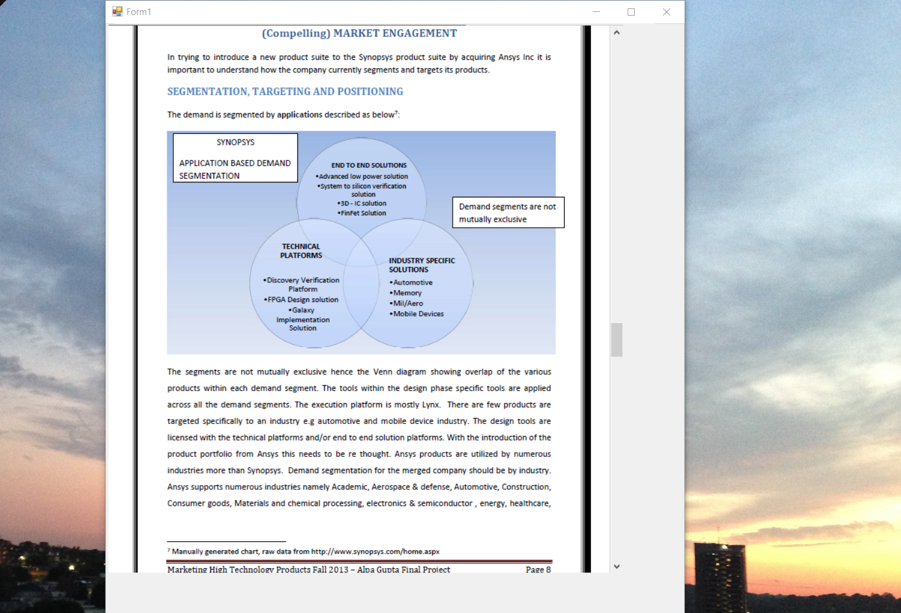

## Marketing Goals and Objectives
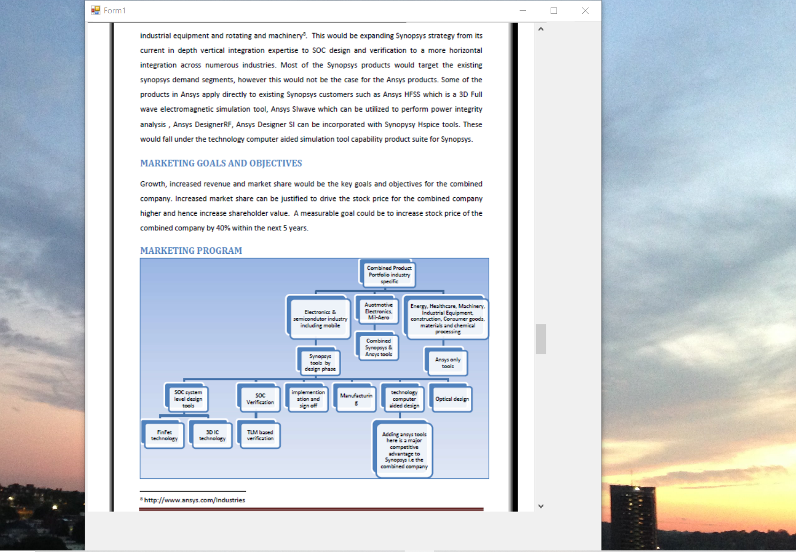

## Marketing Strategy 
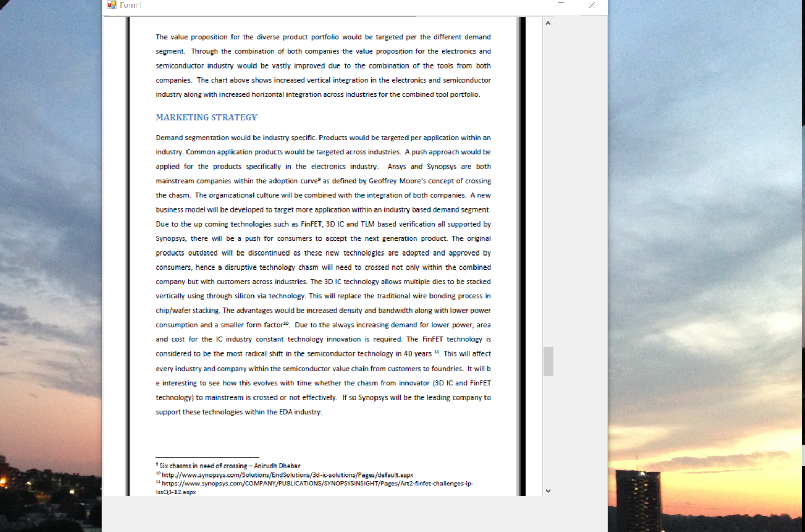

## EDA Regression 
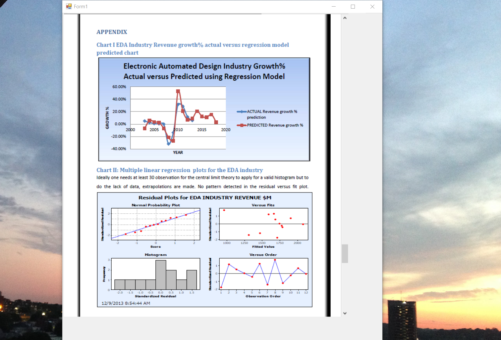

## Multiple Regression Equation
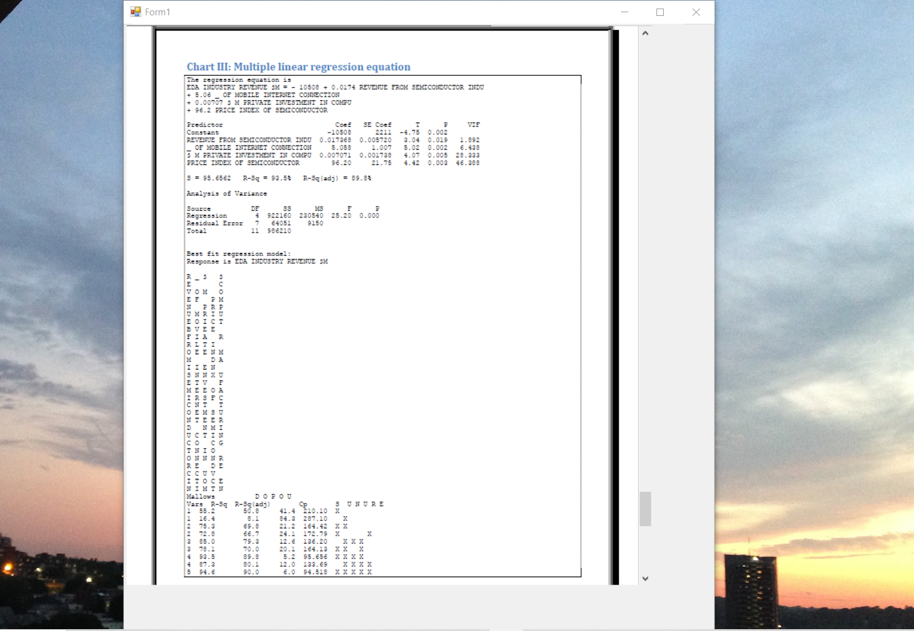

## Predictors
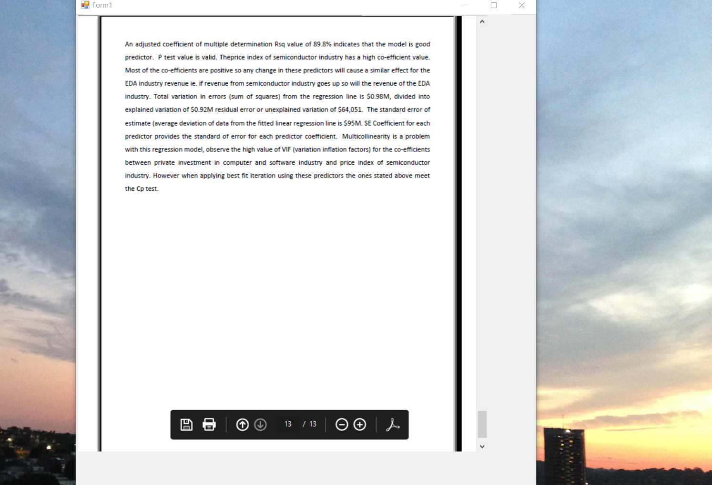

## Project Schedule

Advanced knowledge : https://github.com/alpaddesai/BusinessLaw , https://github.com/alpaddesai/BusinessDevelopmentMergersAcquisitionsIdea and https://github.com/alpaddesai/ManagerialOperations
